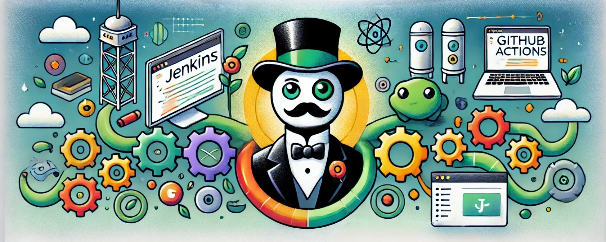

# [Google Summer of Code 2024](https://summerofcode.withgoogle.com/)

## [Transitioning Catroid from Jenkins to GitHub Actions](https://summerofcode.withgoogle.com/programs/2024/projects/viIhgyVz)

The current continuous integration (CI) setup for the Catroid project is based on a self-hosted Jenkins server. While Jenkins has been a powerful tool for automating our build, testing, and deployment processes, it requires ongoing maintenance and infrastructure management. As an open-source project with limited resources, especially in terms of available contributors to manage CI infrastructure, this maintenance overhead is a significant concern.

This project aims to transition Catroid's CI/CD pipeline from Jenkins to GitHub Actions, using self-hosted GitHub runners deployed via GitHub ARC (Actions Runner Controller) on Kubernetes. This transition is motivated by the evolution of GitHub Actions, which now offers robust features and flexibility that meet our project's needs, while reducing the complexity and maintenance burden associated with Jenkins.

### Mentors 👨🏻‍💻

- [Dev Sebastian](https://github.com/devsebastian)
- [Patrick Ratschiller](https://github.com/ratschillerp/)

### Goals 🏁

- Evaluate the current Jenkins setup and identify the key CI/CD workflows to be migrated.
- Set up self-hosted GitHub Actions runners using GitHub ARC on Kubernetes.
- Migrate the identified CI/CD workflows from Jenkins to GitHub Actions.

### Current State 📊

- The current CI/CD pipeline is fully operational on Jenkins, with self-hosted infrastructure. It handles all build and test processes but requires significant manual intervention and maintenance.
- Initial steps to migrate the Jenkins pipelines to GitHub Actions are underway. Basic workflows for building and testing have been created, but full migration is still in progress.
- Set up of self-hosted GitHub Actions runners using GitHub ARC on Kubernetes is completed.

### To-Do 📝

- Finalize the migration of the Jenkins pipelines to GitHub Actions, ensuring all build, test, and deployment workflows are fully functional.

### Challenges 🚧

- Setting up self-hosted GitHub Actions runners with KVM for virtualization to support instrumented tests, such as Espresso tests for Android, has been challenging. KVM is not fully supported on our current setup, and tests are running without hardware acceleration. We should consider switching to BrowserStack as the default service for tests requiring real devices.
- Ensuring that the new GitHub Actions workflows are as efficient as the Jenkins pipelines they are replacing.

### Future Work 🚀

- Optimize the self-hosted runners setup to support hardware-accelerated tests or find alternative solutions such as BrowserStack for instrumented testing.
- Integrate automated pull request reviews using tools like Reviewdog.
- Integrate stale bot to automatically close stale issues and pull requests.
- Explore automated deployment strategies, including blue-green deployments and nightly-builds to minimize downtime and risk during updates.

### Tickets 🎫

Name      | Link |
---------------- | ------------------ |
Support GitHub Action builds on Kubernetes | [DEVOPS-836](https://catrobat.atlassian.net/browse/DEVOPS-836) |
Move Builds from Jenkins to GitHub Actions | [DEVOPS-837](https://catrobat.atlassian.net/browse/DEVOPS-837) |

### Pull Requests 📋

[PR-5021](https://github.com/Catrobat/Catroid/pull/5021): Jenkins 2 Actions

### Acknowledgements 🤝

Special thanks to [Patrick Ratschiller](https://github.com/ratschillerp/) and the entire [Catrobat-Team](https://developer.catrobat.org/).
